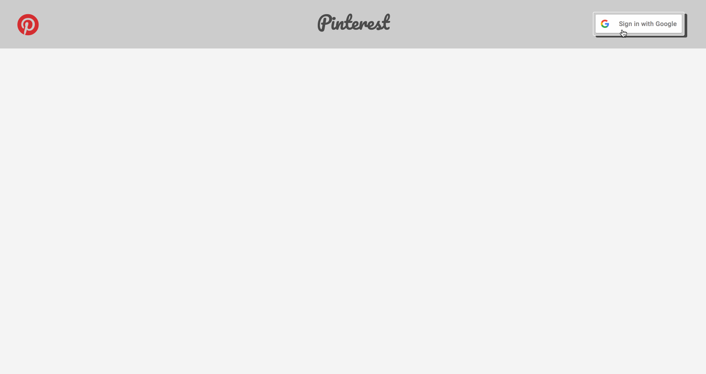
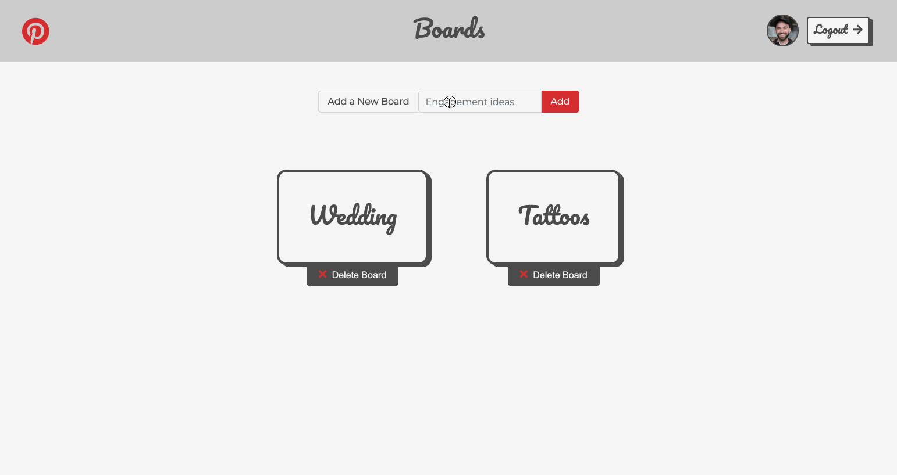
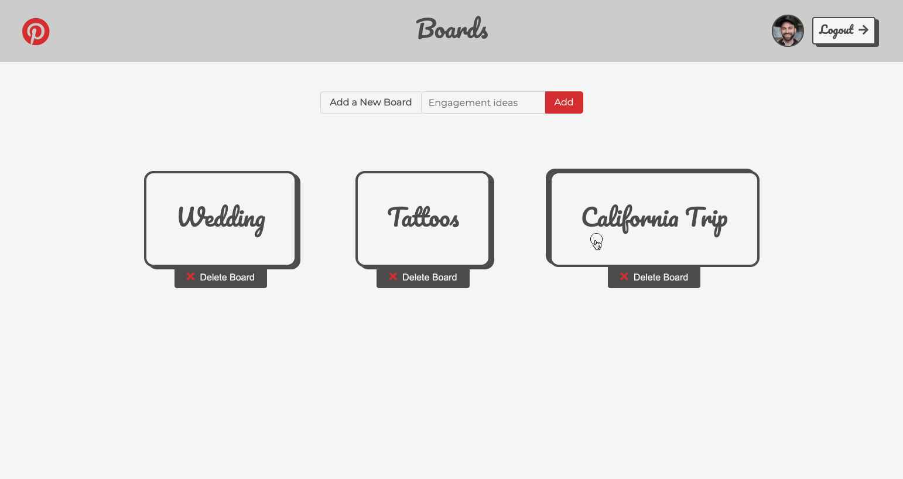
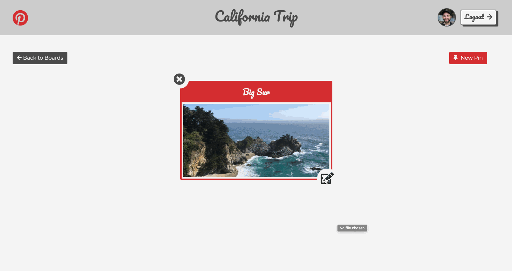
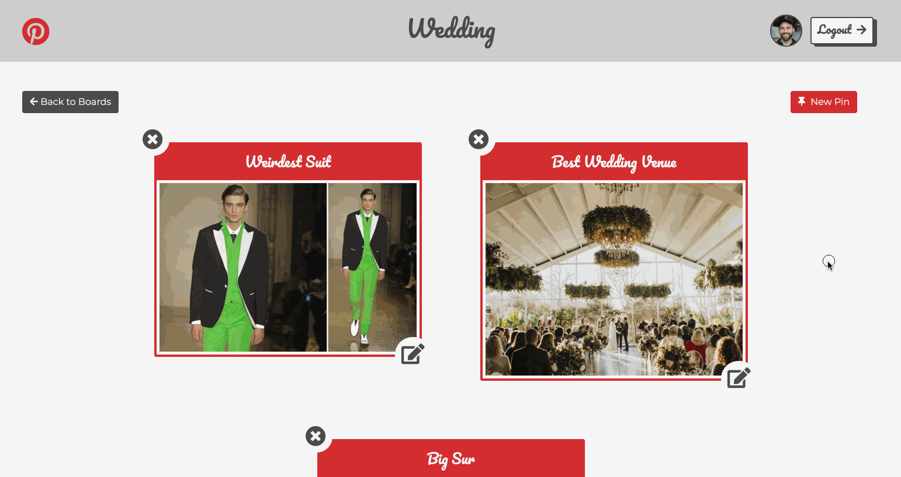

# Pinterest

This project is a version of Pinterest, the popular social media app where users can find inspiration and ideas for their interests and hobbies.

This project allows the user to sign-in through their Google account, allowing them to start creating boards and adding pins to them! You can start by creating a new board. Once created, you can view the board and add pins. When adding pins, you can upload an image that is added to Firebase Storage and displayed on your board.

The User can reassign a pin to a different board, delete a pin, or even delete a board entirely! This Web App at different points is pulling, updating, deleting, or creating data within Firebase. Select the deployed link below to try it out!

## Preview

#### Signing In:

---

#### Adding a New Board:

---

#### Adding a New Pin:

---

#### Reassigning a Pin:

---

#### Deleting Pins & Boards:

## Deployed Project

https://pinterest-1e98b.web.app/

## Clone the Repository
- Clone it 👉🏼 `$ git clone https://github.com/RyanBeiden/pinterest.git`

- Install the dependencies 👉🏼 `$ npm install`

- Run `$ npm start`

## Technologies Used
   

#### Backlog/Roadmap

- Overall mobile responsiveness
